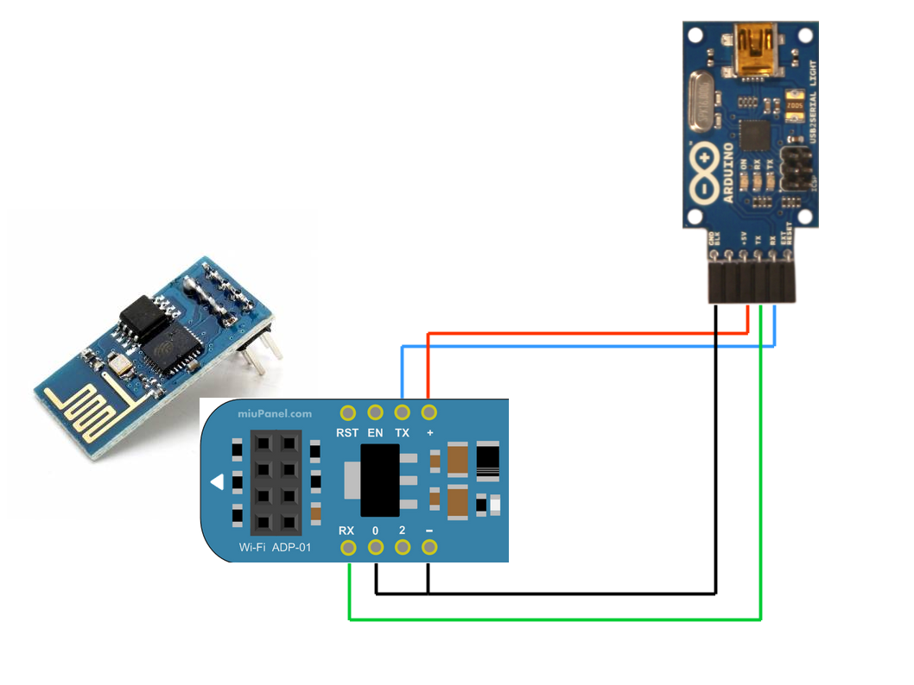

This project permits to the sensors based on Arduino and ESP-01 to comunicate to the SDP in a secure way through HTTPS.

**Note:** ESP-01 use 3.3 volts power. If you use 5 volts power you must use ADP-01 adapter (http://www.miupanel.com/Getting-Started/Wi-Fi-Module/ACCESSORIES/-BREADBOARD-ADAPTER) or any other level converter.

It's composed by two parts:

**ESP_SERIAL**

It's the firmware for ESP-01 chip. It implements the following functions:
* WPA WIFI association
* HTTPS GET
* HTTPS POST

It communicates with the external world (e.g. Arduino) through the Serial port

To build the firmware for ESP-01 use arduino IDE and follow the instruction reported in https://github.com/esp8266/Arduino.

To flash the firmware iit must be used a USB-Serial coonverter (e.g. https://www.arduino.cc/en/Main/USBSerial).

**ESP_SERIAL_ARDUINO**

It's a SDK for arduino that implements low level serial commands to ESP-01.

    espSerial(byte rxPin, byte txPin, byte enPin);
    boolean setWifi(String sid, String psk);
    boolean sslGet(String& body, String host, unsigned int port, String url, String user, String pwd);
    boolean sslPost(String& body, String host, unsigned int port, String url, String data, String user, String pwd);

ESP-01 (or ADP-01) must be connected to arduino throgh three pins: Serial RX, Serial TX, Enable. RX and TX pins must be suitable to manage a SoftwareSerial connection (see https://www.arduino.cc/en/Reference/SoftwareSerial).
